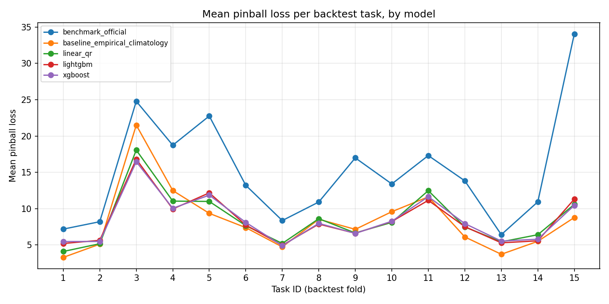
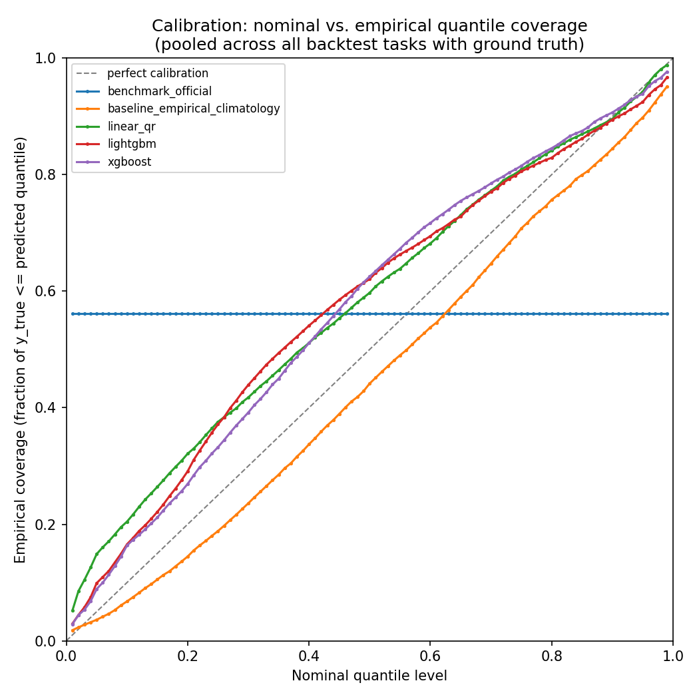

# Probabilistic Electricity Load Forecasting — GEFCom2014-L

One-month-ahead hourly probabilistic load forecasts for the load track of
the Global Energy Forecasting Competition 2014 (GEFCom2014-L_V2), evaluated
with pinball loss and calibration diagnostics across all 15 official
rolling-origin backtest tasks.

## Problem, in short

Every month, the utility needs an hourly forecast of electricity load (MW)
for the following month — not a single number, but a full predictive
distribution (the 1st through 99th percentiles), so that downstream
planning decisions can account for uncertainty rather than just a point
estimate. The dataset provides 15 sequential "tasks": each one reveals one
more month of true history and asks for a 99-quantile forecast of the next,
unseen month. Hourly temperature readings from 25 weather stations are also
provided, but real temperature for the forecast month would not normally
be known in advance — this is treated as an explicit, testable modelling
assumption (see "Leakage protection" below), not an oversight.

## Repository layout

```
├── configs/config.yaml          # all paths, tasks, models, hyperparameters
├── requirements.txt             # pinned environment
├── src/gefcom/                  # the actual package
│   ├── data_loading.py          # TaskBundle construction, cumulative history
│   ├── discovery.py             # locates train/benchmark/solution files
│   ├── timestamps.py            # robust hourly-grid reconstruction
│   ├── features.py              # calendar + climatology feature engineering
│   ├── baselines.py             # empirical-quantile climatology baseline
│   ├── quantile_models.py       # linear_qr / lightgbm / xgboost, knot-based
│   ├── metrics.py                # pinball loss and friends
│   ├── calibration.py           # reliability curve, interval coverage
│   ├── stats_tests.py           # HAC-corrected Diebold-Mariano test
│   ├── pipeline.py               # orchestrates one task end-to-end
│   └── lstm_model.py             # optional, off by default
├── scripts/
│   ├── run_backtest.py           # the main entry point — produces all results below
│   ├── tune_hyperparams.py       # leakage-safe internal-fold tuning
│   ├── internal_multi_fold_backtest.py  # extra model-comparison folds, no Solution files needed
│   ├── make_plots.py             # calibration + per-task pinball plots
│   ├── make_results_section.py   # renders outputs/*.csv as markdown tables
│   ├── diagnose_task_files.py    # standalone per-file sanity check (see "Limitations")
│   └── run_lstm_experiment.py    # optional LSTM comparison
├── tests/                        # pytest -- leakage guards, metric checks, timestamp parsing
└── outputs/                      # generated CSVs + PNGs (gitignored raw data, kept results)
```

## Reproducing the results

1. Create the environment:
   ```bash
   pip install -r requirements.txt
   ```
2. Download `GEFCom2014-L_V2` from Kaggle and place the `Load` folder so
   that `data/GEFCom2014-L_V2/Load/Task 1/L1-train.csv` exists (relative to
   the repo root). Adjust `configs/config.yaml → paths.load_dir` if you
   keep it elsewhere.
3. (Optional, already-tuned parameters are checked into `configs/config.yaml`)
   Re-tune hyperparameters if you want to reproduce that step too:
   ```bash
   python scripts/tune_hyperparams.py --config configs/config.yaml --family lightgbm --n-trials 30
   python scripts/tune_hyperparams.py --config configs/config.yaml --family xgboost --n-trials 30
   ```
   and copy the resulting `outputs/best_params_*.json` values into
   `configs/config.yaml → models.<family>`.
4. Run the full backtest across all 15 tasks:
   ```bash
   python scripts/run_backtest.py --config configs/config.yaml
   ```
5. Generate plots and a paste-ready results section:
   ```bash
   python scripts/make_plots.py --config configs/config.yaml
   python scripts/make_results_section.py --output-dir outputs > results_section.md
   ```
6. Run the test suite:
   ```bash
   pytest -v
   ```

For a fast development run instead of the full 15 tasks:
```bash
python scripts/run_backtest.py --config configs/config.yaml --tasks 1,2,3
```

## Validation design (rolling-origin backtest)

Each of the 15 GEFCom2014-L tasks *is* one expanding-window backtest fold by
construction: task *N*'s own training file reveals history strictly before
task *N*'s target month, and the target month is exactly the one held out.
No additional manual cross-validation splitting of the 15 tasks was needed
or added — this is the backtesting scheme, and it directly mirrors how the
model would really be used in production (retrain monthly on everything
known so far, forecast the next unseen month).

Within a single task, the LightGBM/XGBoost models additionally use a
trailing 10% validation slice of the *training* period only (never the
target month) for early stopping.

A second, complementary internal backtest
(`scripts/internal_multi_fold_backtest.py`) carves extra held-out months
directly out of each task's own training history (the same leakage-safe
"hold out the trailing month" trick used for hyperparameter tuning). This
does not require official Kaggle Solution files, and gives more
(task, fold) pairs to assess variance with.

## Leakage protection and explicit assumptions

The single biggest design decision in this project (see `features.py`
docstring for the full reasoning): forecasts are produced for an entire
target month in one shot, not recursively hour-by-hour. This deliberately
rules out short load lags (lag-1h, lag-24h, ...), since for an hour deep
into the target month, "load 24h ago" would often fall *inside* the same
unobserved month. All features are one of:

- **Calendar features** (hour/day/month/weekday/holiday, cyclic encodings,
  a `trend` term) — exactly knowable for any future timestamp.
- **Load climatology** — (month, hour, day-of-week) historical statistics
  of LOAD, fit only on data strictly before the target month.
- **Weather-ensemble climatology** — the same idea applied to aggregate
  statistics (mean/median/std/HDD/CDD) across the 25 weather stations,
  again fit only on pre-target-month history.

**Temperature assumption:** by default, weather features for the target
month use the *climatology* lookup above, never the real observed
temperature for that month — this is the leakage-safe default. A
separate, explicitly-labelled **oracle-weather** comparison
(`leakage.run_oracle_comparison: true` in the config) re-fits every model
using the *real* observed temperature for the target month, purely to
measure how much the no-future-temperature assumption costs in practice.
It is off by default and never used for the headline numbers below.

## Baselines

Two baselines, per the assignment's requirement:

1. **`benchmark_official`** — the GEFCom2014-supplied naive benchmark
   (same month last year, flatly expanded to 99 quantiles). Deliberately
   weak; reported as a sanity floor.
2. **`baseline_empirical_climatology`** — for each (month, hour,
   is-weekend) group, the empirical 1st–99th percentiles of historical
   LOAD, estimated only from data strictly before the target month. This
   is a materially stronger baseline, since it already captures
   time-of-day and seasonal shape, and it is the bar every sophisticated
   model must clear.

## Models

Three quantile-regression families, all fit at 23 knot quantiles
(both tails included) and linearly interpolated to the full 1–99 grid to
keep laptop-CPU runtime reasonable:

- `linear_qr` — scikit-learn `QuantileRegressor` on a small, curated
  feature subset.
- `lightgbm` — `objective="quantile"`, primary gradient-boosted model.
- `xgboost` — `objective="reg:quantileerror"`, secondary comparison model.

For each, three variants were also evaluated:
- **plain** — fit directly on LOAD.
- **`__residual`** — fit on the residual against the empirical-climatology
  baseline's median, then added back (lets the model focus on what the
  baseline doesn't already capture).
- **`__ens_baseline`** — a simple 50/50 average of the model's prediction
  and the empirical-climatology baseline's prediction.

Hyperparameters for LightGBM/XGBoost were tuned with Optuna (30 trials
each) using leakage-safe internal expanding-window folds carved from
Task 1's own history only (`scripts/tune_hyperparams.py`), keeping the
tuning task's real target month untouched and out of the reported
backtest numbers' influence on hyperparameter selection.

## Results

Mean pinball loss across all 15 backtest tasks (lower is better):

| model                           |   mean |    std | n tasks |
|:---------------------------------|-------:|-------:|--------:|
| lightgbm__ens_baseline           | 8.1178 | 3.9093 |      15 |
| xgboost__ens_baseline            | 8.1388 | 3.8261 |      15 |
| xgboost__residual                | 8.1525 | 3.5703 |      15 |
| lightgbm__residual                | 8.2226 | 3.8064 |      15 |
| linear_qr__ens_baseline           | 8.2421 | 4.0959 |      15 |
| **baseline_empirical_climatology**| **8.3273** | **4.5505** | **15** |
| lightgbm                         | 8.4046 | 3.3334 |      15 |
| linear_qr__residual               | 8.4309 | 3.5091 |      15 |
| xgboost                           | 8.4373 | 3.1916 |      15 |
| linear_qr                         | 8.5369 | 3.6329 |      15 |
| benchmark_official                | 15.1433| 7.5957 |      15 |



**Statistical comparison (Diebold-Mariano test, HAC-corrected, pooled
hourly loss across all tasks, n=10,968):**

- Every model variant beats `benchmark_official` overwhelmingly
  (p < 0.0001 in all cases) — confirming the naive year-ago benchmark is,
  as intended, a very weak floor.
- Against `baseline_empirical_climatology`, the **plain** `linear_qr`,
  `lightgbm`, and `xgboost` models do **not** significantly beat the
  baseline (p = 0.05–0.65) — in most cases the baseline is nominally
  *better* on average, though not significantly so.
- Only the **ensemble-with-baseline** variants show a statistically
  significant improvement over the baseline alone:
  `lightgbm__ens_baseline` (mean diff −0.219, p = 0.0005) and
  `xgboost__ens_baseline` (mean diff −0.198, p = 0.0015).

**Honest headline:** the empirical-quantile climatology baseline is
already a strong forecaster for this series. Sophisticated models alone do
not reliably beat it; blending a model's prediction 50/50 with the
baseline is the only variant that provides a statistically defensible
improvement.

### Calibration



- `benchmark_official` is severely miscalibrated (its coverage curve is
  flat at ~0.56 regardless of nominal level) — its 99 "quantiles" don't
  actually spread out with the target load's true variability, consistent
  with it being a deliberately naive benchmark.
- `baseline_empirical_climatology` tracks the diagonal (perfect
  calibration) most closely of all five models shown.
- `linear_qr`, `lightgbm`, and `xgboost` are all noticeably overconfident
  in the lower-to-middle quantile range (empirical coverage sits above the
  diagonal there), meaning their predicted quantiles in that range run
  systematically a bit high relative to what's actually observed.

Empirical coverage of central intervals (nominal 90%: e.g.
`baseline_empirical_climatology` achieves 0.863, `xgboost__ens_baseline`
achieves 0.870 — both reasonably close to nominal; the raw ML models
(0.79–0.85) undercover slightly more).

### Notable fold-to-fold variance

Task 15's `benchmark_official` loss (34.07) is roughly 4x the average —
an unusual month where "same month last year" failed badly, while every
other model handled it far better (climatology baseline: 8.78, xgboost:
10.45). This is exactly the kind of single-number trap requirement 5 warns
against — it's why 15 folds with a DM test are reported rather than one
score.

## Limitations and unsuccessful approaches

- **A real timestamp-parsing bug, found and fixed:** the raw
  `TIMESTAMP` format concatenates month+day+year with no separators and
  no fixed width (e.g. `"1012010 1:00"`), which is genuinely ambiguous
  whenever a file starts on the 1st of a two-digit month (Oct/Nov/Dec) --
  both `(month=1, day=01)` and `(month=10, day=1)` are valid splits with
  `day == 1`. This silently mis-parsed Tasks 2 and 14 (both genuinely
  start Oct 1st) as if they began in January, which initially looked like
  corrupted/duplicated downloaded files. The fix anchors every task after
  the first on continuity from the accumulated history (the same approach
  already used for benchmark/solution files) instead of self-parsing each
  file's own first row; `reconstruct_hourly_index`'s internal spot-check
  against unambiguous rows still catches genuine file corruption by
  raising loudly. See `data_loading.py` and `timestamps.py` docstrings.
- **Ensembling with the baseline works; the raw models alone don't
  clearly help.** This was somewhat unexpected going in, and is reported
  honestly above rather than only showing the best variant.
- **LSTM (optional, `run_lstm_experiment.py`):** included to test whether
  a sequence model over the same leakage-safe feature stream captures
  temporal structure the per-hour GBMs miss. Not part of the default
  backtest and not expected to beat LightGBM/XGBoost — reported only as a
  comparison point per-task, not in the main table.
- **What I'd try next with more time:** a proper stacking/blending weight
  (rather than fixed 50/50) learned on validation folds; quantile
  crossing-aware loss functions instead of post-hoc sorting; per-zone or
  per-season model selection given the visible fold-to-fold variance.

## Tests

```bash
pytest -v
```

Covers: leakage guarantees (`test_no_leakage.py` — history/target
non-overlap, feature-column consistency, trend continuity, climatology
purity, oracle-mode fail-loud behaviour), metric correctness
(`test_metrics.py`), Diebold-Mariano correctness and HAC-vs-naive variance
behaviour (`test_stats_tests.py`), timestamp reconstruction including the
ambiguous-date edge cases above (`test_timestamps.py`), and a full
end-to-end pipeline run on a synthetic fixture task
(`test_pipeline_integration.py`).
